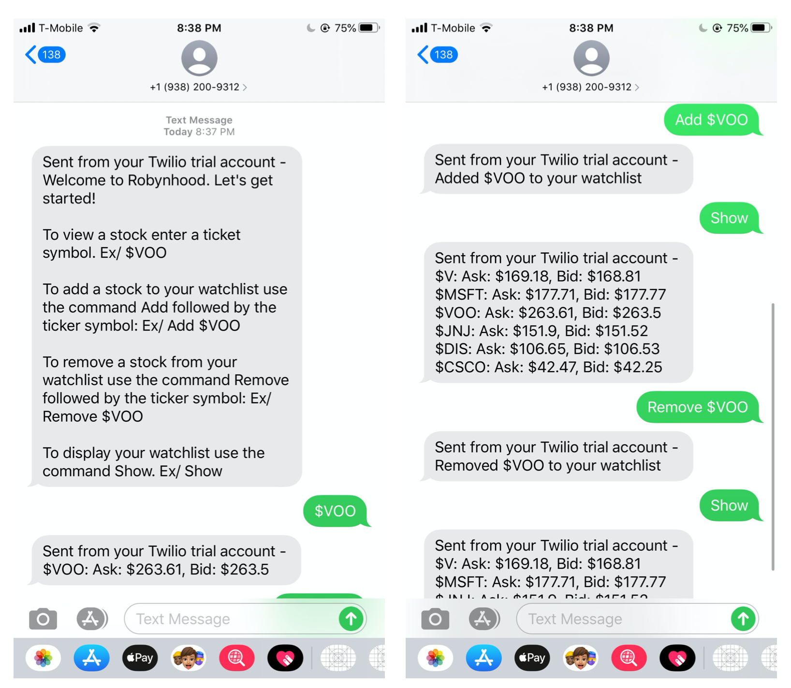

# Robynhood

Robynhood is an interactive SMS application that allow users to view stock prices, add, remove and show stocks to/from a watchlist. It is intended for individuals who want to check stock information, but wifi/data connectivity is limited.



## Getting Started

Clone the repository into your workspace.

```
$ git clone https://github.com/zhangjeffer/Robynhood.git
$ cd Robynhood
```

### Prerequisites

Make sure you are running Python 3.x and install the packages listed below.

```
pip install boto3
pip install flask
pip install twilio
pip install yfinance
```

### Installing

1. Setup an AWS account, create a DynamoDB table and name it 'rh_offline_users'.
2. Setup a Twilio account and environment variables
```
$ export ACCOUNT_SID='ACCOUNT SID'
$ export AUTH_TOKEN='AUTH TOKEN'
```
3. Download, setup and start ngrok on port 5000. Make sure to add /sms to the end of the route.
```
$ ./ngrok http 5000
```
4. Set Twilio's incoming message webhook to ngrok's http tunnel.
5. Start the application. 
```
$ python receive.py
```
6. Register a caller ID to test.
7. Send an inital message to the caller ID registered.
```
$ python send.py +1XXXXXXXXXX
```

## Built With

* [Python](https://www.python.org/) - Development language
* [Flask](https://flask.palletsprojects.com/en/1.1.x/) - Python's web framework
* [DynamoDB](https://aws.amazon.com/dynamodb/) - Database
* [Twilio](https://www.twilio.com/) - Used to handle SMS messaging
* [ngrok](https://ngrok.com/) - Used to create http tunnel

## Author

**Jeffer Zhang** - *Initial work* 

## License

This project is licensed under the MIT License - see the [LICENSE.md](LICENSE.md) file for details

## WIP
* Clean up directory structure. 
* Deploy on AWS Lambda. 
* Swap out yfinance for IEX API.
